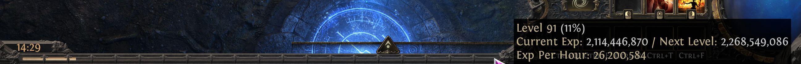

# Maps 

| Name | Opinion | Notes |  Thumbnail (click image for larger image) |
| --- | --- | --- | --- |
| Augury | shit | underground crypt-type map, small corridors - pull levers for room in middle of map, otherwise just like Seepage |
| Backwash | shit | tree roots, not great for breech |
| Blooming Field | shit | Vines and bad pathing |
| Bluff | - | tower |
| Burial Bog | good | fairly wide lanes with not much obstruction, dreary though |  |
| Crypt | average | not great for breech, corridors about 6 characters wide | - |
| Forge | average | elavated moderate passageways over lava |
| Hive | average | desert map, smaller lanes, open and sunny which is nice, but not great for breach |
| Hidden Grotto | average | not great for breeches, 4-5 width lanes but at least minions can shoot between them and aren't blocked |
| Limestone Hideout  | - | get limestone hideout |
| Mesa  | - | tower |
| Mire  | shit | wicker map with narrow lanes |
| Oasis | great | wide open map |
| Ravine | average | very linear, open outside canyon-like, not great for breach, at least minions don't get stuck in doorways, like a tower map |
| Rustbowl | great | open, good visibility, rust colored |
| Sandspit | great | lots of beachfront, wide open lanes except through the mid|
| Seepage | shit | underground crypt-type map, small corridors - boss room in SW, otherwise just like Augury |
| Sinking Spire | - | tower - inside a pyramid, map is a triangle with 3 floors | |
| Slick | great | underground, wide corridors |
| Steaming Springs | great | fairly open desert/tropical type map with small corridors between each wide open section |
| Steppe | great | wide open |
